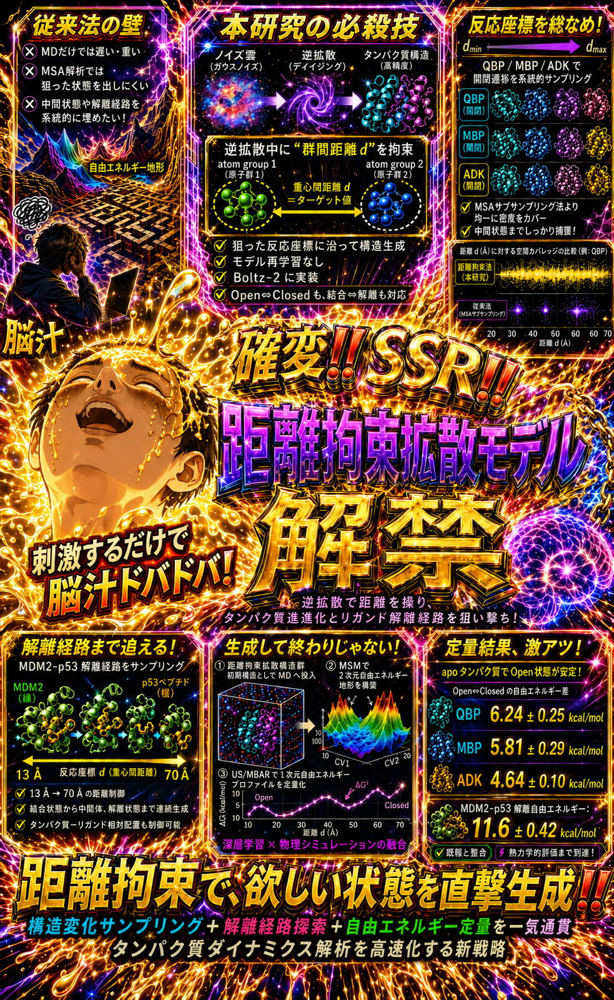

# 論文
https://pubs.acs.org/doi/10.1021/acs.jctc.6c00199

# 実装
https://github.com/cddlab/boltz_restr

# 真面目に書いた解説記事
https://cddlab.io/blog/2026/05/22/distres/

# 宣伝ツイート🎉🎉
https://x.com/cuemolnohito/status/2053742544279019875

https://x.com/cuemolnohito/status/2058825601021280557

# チャッピーで適当に作らせたグラフィカルアブストラクトです😎

