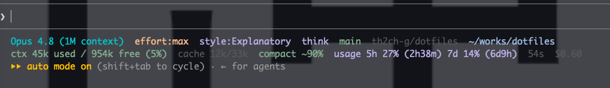

# 2026年夏時点で、最近取り入れた特筆すべき設定たち
##  curlによるワンラインインストール
以前は長ったらしいワンライナーをコピペする感じにしてたが、rustやclaudecodeのようにcurlでinstallできるようにした（claudecodeが）。
interactiveで設定出来て便利。

```sh
curl -fsSL https://raw.githubusercontent.com/th2ch-g/dotfiles/main/setup.sh | bash
```

##  zshrcのコンパイル
ここらへんの記事を参考にした、すごい早くなった

https://zenn.dev/fuzmare/articles/zsh-plugin-manager-cache

https://zenn.dev/fuzmare/articles/zsh-source-zcompile-all

##  claudeのstatusline設定
オシャンティーにしてもらった（claudecodeに）。



##  claude auto mode
以前は怖かったのでnonoとかいうサンドボックスを使ってbypass-permissionでやっていたのですが、それすらもめんどくさくなって来てauto modeをデフォにしました。めっちゃ便利

https://github.com/always-further/nono

##  pixi global install
以前はinstall_scripts下にビルドしたりcurlしてバイナリを置く感じにしてたが、遅いのと管理がめんどくさいので、pixiのglobalになるべく統合。
Brewfileに置いてたpkgsもpixiのcondaで扱えるならpixiに移行した。

##  cargo/gh-extention yaml化
list.txtという行単位でpkgsを管理してたが、汚かったのでyamlにした。
cargoやghにこういうものをうまく管理させる機能などがついて欲しい（もしくはついているのか？）

https://github.com/th2ch-g/dotfiles/blob/31da4ca9e183095849e08a70bf9393da40c433d3/cargo/list.yaml

https://github.com/th2ch-g/dotfiles/blob/31da4ca9e183095849e08a70bf9393da40c433d3/gh-ext/list.yaml

##  nvimのプラグイン遅延読み込み
lazy.nvimの遅延読み込みを有効化、今までやってなくて有効化したが早くなった気がする。
codeiumやavanteといったAI系のプラグインはバイバイした👋

https://github.com/Exafunction/windsurf.vim

https://github.com/yetone/avante.nvim

##  brew pkgsの整理
散らかっていたbrewのパッケージをBrewfileに拘束するようにした。
でも間違ってthunder birdを消してしまったorz

https://github.com/th2ch-g/dotfiles/blob/31da4ca9e183095849e08a70bf9393da40c433d3/brew/run.sh#L15

##  git pushで`--set-upstream`不要化
git pushするたび未pushのブランチをpushするときに`--set-upstream`みたいなおまじないをつけないといけなかったので、入れなくて済むようにしました。

https://github.com/th2ch-g/dotfiles/blob/31da4ca9e183095849e08a70bf9393da40c433d3/git/config#L29
